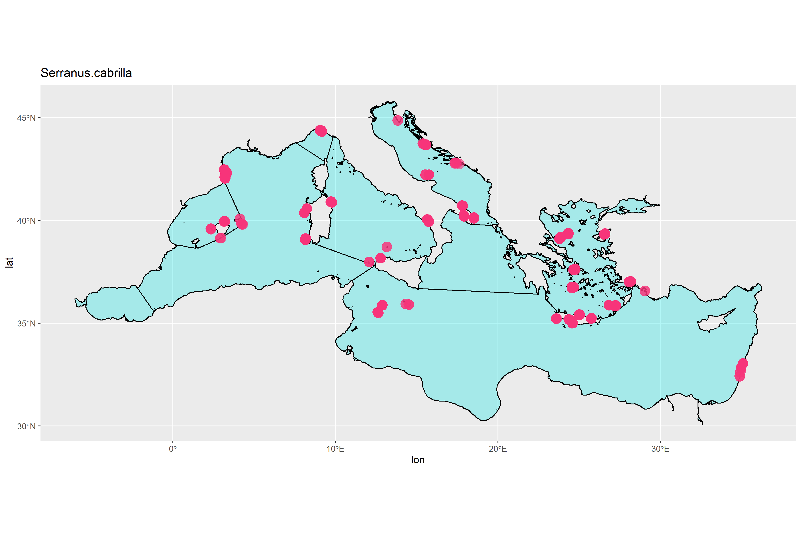
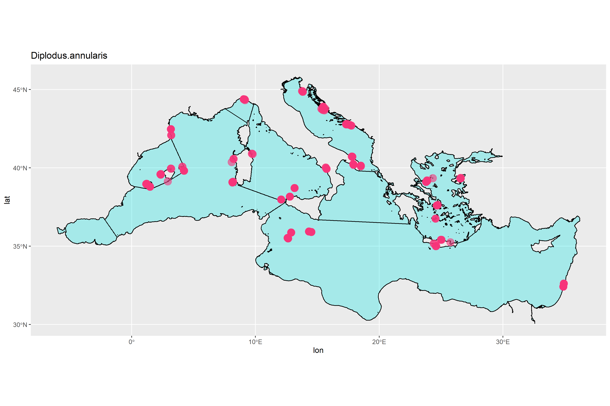

```{r Setup, include=FALSE}
library(magrittr)
library(tidyverse)

```

* Run the 'results.Rmd' file first

# Species dispersal

## Groupers





## Seabreams



```{r}
herbivores

```

## Herbivores


