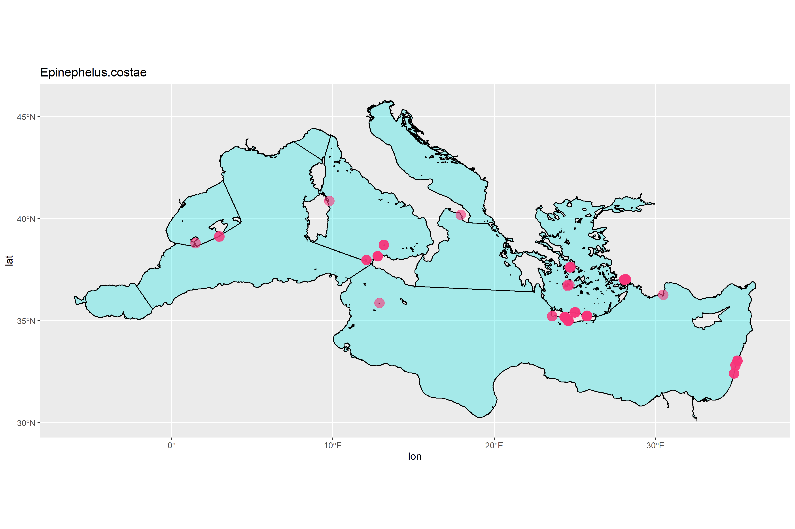
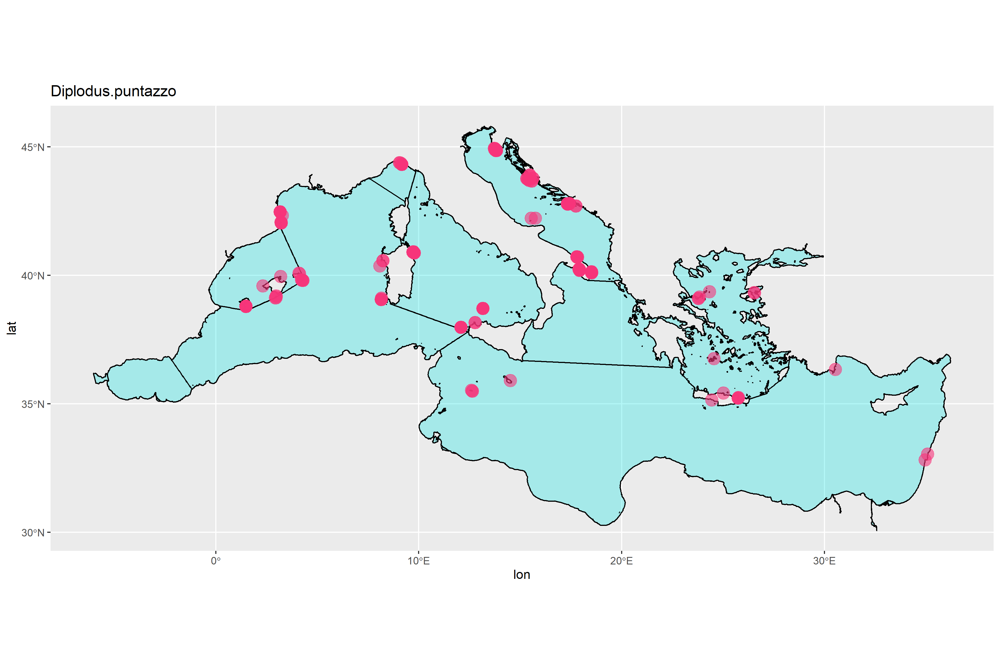

```{r Setup, include=FALSE}
library(magrittr)
library(tidyverse)

```

* Run the 'results.Rmd' file first

# Species dispersal

## Groupers





## Seabreams





```{r}
herbivores

```

## Herbivores


# Seasons

```{r}

# med_raw <- read_rds("data/medata.Rds")
med_seas <- sf::st_read("~/MSc/MEDATA/Med_World_Seas_IHO_v3_MarineRegions/Medit_seas_IHO.shp")

```

## Groupers

```{r}
grps_seasons <- med_raw %>%
  filter(species %in% groupers) %>% 
  group_by(country, lon, lat, species, season) %>% 
  summarise(count = n()) %>% 
  arrange(season)

ggplot(data = grps_seasons) +
  geom_sf(data = med_seas, colour = "black", fill = "#00E5E5", alpha = 0.3) +
  geom_point(aes(x = lon, y = lat, colour = season, size = count), alpha = 0.5) +
  facet_grid(vars(species))


```

## Seabreams

```{r}
dip_seasons <- med_raw %>%
  filter(species %in% diplodus) %>% 
  group_by(country, lon, lat, species, season) %>% 
  summarise(count = n()) %>% 
  arrange(season)

ggplot(data = dip_seasons) +
  geom_sf(data = med_seas, colour = "black", fill = "#00E5E5", alpha = 0.3) +
  geom_point(aes(x = lon, y = lat, colour = season, size = count), alpha = 0.5) +
  facet_grid(vars(species))


```

## Herbivores

```{r}
herb_seasons <- med_raw %>%
  filter(species %in% herbivores) %>% 
  group_by(country, lon, lat, species, season) %>% 
  summarise(count = n()) %>% 
  arrange(season)

ggplot(data = herb_seasons) +
  geom_sf(data = med_seas, colour = "black", fill = "#00E5E5", alpha = 0.3) +
  geom_point(aes(x = lon, y = lat, colour = season, size = count), alpha = 0.5) +
  facet_grid(vars(species))


```
Not sure I can understand trends from it as surveys are seasonally separated as they are geographically separated..  

# Sites comparison

Rarefaction

```{r}
# library(vegan, warn.conflicts = FALSE)
med_raw %>% distinct(country)

italy_acc <- med_raw %>% 
  filter(country == "Italy") %>% 
  dplyr::mutate(loc = paste0(site, "_", trans)) %>%
  dplyr::group_by(loc, species) %>% 
  dplyr::summarise(abund = sum(sp.n)) %>%
  tidyr::spread(key = species, value = abund, fill = 0) %>% 
  tibble::column_to_rownames(var = "loc") %>% 
  vegan::specaccum(method = "rarefaction")

malta_acc <- med_raw %>% 
  filter(country == "Malta") %>% 
  dplyr::mutate(loc = paste0(site, "_", trans)) %>%
  dplyr::group_by(loc, species) %>% 
  dplyr::summarise(abund = sum(sp.n)) %>%
  tidyr::spread(key = species, value = abund, fill = 0) %>% 
  tibble::column_to_rownames(var = "loc") %>% 
  vegan::specaccum(method = "rarefaction")

turkey_acc <- med_raw %>% 
  filter(country == "Turkey") %>% 
  dplyr::mutate(loc = paste0(site, "_", trans)) %>%
  dplyr::group_by(loc, species) %>% 
  dplyr::summarise(abund = sum(sp.n)) %>%
  tidyr::spread(key = species, value = abund, fill = 0) %>% 
  tibble::column_to_rownames(var = "loc") %>% 
  vegan::specaccum(method = "rarefaction")

spain_acc <- med_raw %>% 
  filter(country == "Spain") %>% 
  dplyr::mutate(loc = paste0(site, "_", trans)) %>%
  dplyr::group_by(loc, species) %>% 
  dplyr::summarise(abund = sum(sp.n)) %>%
  tidyr::spread(key = species, value = abund, fill = 0) %>% 
  tibble::column_to_rownames(var = "loc") %>% 
  vegan::specaccum(method = "rarefaction")

greece_acc <- med_raw %>% 
  filter(country == "Greece") %>% 
  dplyr::mutate(loc = paste0(site, "_", trans)) %>%
  dplyr::group_by(loc, species) %>% 
  dplyr::summarise(abund = sum(sp.n)) %>%
  tidyr::spread(key = species, value = abund, fill = 0) %>% 
  tibble::column_to_rownames(var = "loc") %>% 
  vegan::specaccum(method = "rarefaction")

israel_acc <- med_raw %>% 
  filter(country == "Israel") %>% 
  dplyr::mutate(loc = paste0(site, "_", trans)) %>%
  dplyr::group_by(site, species) %>% 
  dplyr::summarise(abund = sum(sp.n)) %>%
  tidyr::spread(key = species, value = abund, fill = 0) %>% 
  tibble::column_to_rownames(var = "site") %>% 
  vegan::specaccum(method = "rarefaction")

croat_acc <- med_raw %>% 
  filter(country == "Croatia") %>% 
  dplyr::mutate(loc = paste0(site, "_", trans)) %>%
  dplyr::group_by(loc, species) %>% 
  dplyr::summarise(abund = sum(sp.n)) %>%
  tidyr::spread(key = species, value = abund, fill = 0) %>% 
  tibble::column_to_rownames(var = "loc") %>% 
  vegan::specaccum(method = "rarefaction")

france_acc <- med_raw %>% 
  filter(country == "France") %>% 
  dplyr::mutate(loc = paste0(site, "_", trans)) %>%
  dplyr::group_by(loc, species) %>% 
  dplyr::summarise(abund = sum(sp.n)) %>%
  tidyr::spread(key = species, value = abund, fill = 0) %>% 
  tibble::column_to_rownames(var = "loc") %>% 
  vegan::specaccum(method = "rarefaction")


plot(italy_acc, xlab = 'Samples', ylab = 'Number of species')
plot(malta_acc, add = T, col = 'blue')
plot(turkey_acc, add = T, col = 'coral')
plot(spain_acc, add = T, col = 'darkred')
plot(greece_acc, add = T, col = 'aquamarine4')
plot(israel_acc, add = T, col = 'blueviolet')
plot(croat_acc, add = T, col = 'brown')
plot(france_acc, add = T, col = 'chartreuse4')
legend('bottomright',
       legend = unique(med_raw$country),
       lty = 'solid',
       col = c('black', 'blue','coral', 'darkred', 'aquamarine4', 'blueviolet', 'brown', 'chartreuse4'))
```

Sites rather than locations
```{r}
# library(vegan, warn.conflicts = FALSE)

italy_acc <- med_raw %>% 
  filter(country == "Italy") %>% 
  dplyr::group_by(site, species) %>% 
  dplyr::summarise(abund = sum(sp.n)) %>%
  tidyr::spread(key = species, value = abund, fill = 0) %>% 
  tibble::column_to_rownames(var = "site") %>% 
  vegan::specaccum(method = "rarefaction")

malta_acc <- med_raw %>% 
  filter(country == "Malta") %>% 
  dplyr::group_by(site, species) %>% 
  dplyr::summarise(abund = sum(sp.n)) %>%
  tidyr::spread(key = species, value = abund, fill = 0) %>% 
  tibble::column_to_rownames(var = "site") %>% 
  vegan::specaccum(method = "rarefaction")

turkey_acc <- med_raw %>% 
  filter(country == "Turkey") %>% 
  dplyr::group_by(site, species) %>% 
  dplyr::summarise(abund = sum(sp.n)) %>%
  tidyr::spread(key = species, value = abund, fill = 0) %>% 
  tibble::column_to_rownames(var = "site") %>% 
  vegan::specaccum(method = "rarefaction")

spain_acc <- med_raw %>% 
  filter(country == "Spain") %>% 
  dplyr::group_by(site, species) %>% 
  dplyr::summarise(abund = sum(sp.n)) %>%
  tidyr::spread(key = species, value = abund, fill = 0) %>% 
  tibble::column_to_rownames(var = "site") %>% 
  vegan::specaccum(method = "rarefaction")

greece_acc <- med_raw %>% 
  filter(country == "Greece") %>% 
  dplyr::group_by(site, species) %>% 
  dplyr::summarise(abund = sum(sp.n)) %>%
  tidyr::spread(key = species, value = abund, fill = 0) %>% 
  tibble::column_to_rownames(var = "site") %>% 
  vegan::specaccum(method = "rarefaction")

israel_acc <- med_raw %>% 
  filter(country == "Israel") %>% 
  dplyr::group_by(site, species) %>% 
  dplyr::summarise(abund = sum(sp.n)) %>%
  tidyr::spread(key = species, value = abund, fill = 0) %>% 
  tibble::column_to_rownames(var = "site") %>% 
  vegan::specaccum(method = "rarefaction")

croat_acc <- med_raw %>% 
  filter(country == "Croatia") %>% 
  dplyr::group_by(site, species) %>% 
  dplyr::summarise(abund = sum(sp.n)) %>%
  tidyr::spread(key = species, value = abund, fill = 0) %>% 
  tibble::column_to_rownames(var = "site") %>% 
  vegan::specaccum(method = "rarefaction")

france_acc <- med_raw %>% 
  filter(country == "France") %>% 
  dplyr::group_by(site, species) %>% 
  dplyr::summarise(abund = sum(sp.n)) %>%
  tidyr::spread(key = species, value = abund, fill = 0) %>% 
  tibble::column_to_rownames(var = "site") %>% 
  vegan::specaccum(method = "rarefaction")


plot(italy_acc, xlab = 'Samples', ylab = 'Number of species')
plot(malta_acc, add = T, col = 'blue')
plot(turkey_acc, add = T, col = 'coral')
plot(spain_acc, add = T, col = 'darkred')
plot(greece_acc, add = T, col = 'aquamarine4')
plot(israel_acc, add = T, col = 'blueviolet')
plot(croat_acc, add = T, col = 'brown')
plot(france_acc, add = T, col = 'chartreuse4')
legend('bottomright',
       legend = unique(med_raw$country),
       lty = 'solid',
       col = c('black', 'blue','coral', 'darkred', 'aquamarine4', 'blueviolet', 'brown', 'chartreuse4'))

```

